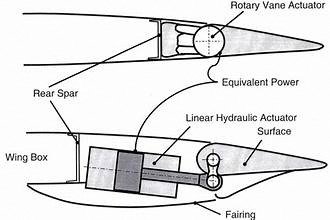

## Topics

- Nature of Matter

## Key Points

- Matter
- SI units/MKS system
	- Base units
	- Derived units
- Prefix/Suffixes

## Definitions

- MKS System: Meter Kilogram Seconds
- Base Units: Intrinsic measurements, no more "basic" unit
- Prefixes: used to denote standard form on values

## Examples

Hydraulic Actuator Example, used to move rudders, flaps, etc

Spars in aircraft frame

## Questions

- 

## Exam Tips

- 
